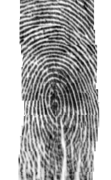
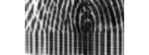
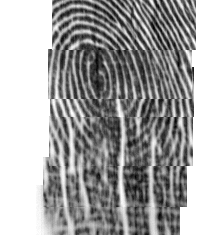
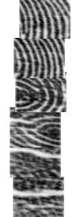

# A fork of libfrpint with ElanTech fingerprint reader driver

Original libfprint readme is in [README](README)

## Supported readers

`04f3: 0903, 0907, 0c01-0c33`

## Getting code and Build tools

libfprint is built with [Meson Build System](http://mesonbuild.com/Quick-guide.html).

**If you installed libfprint from source before c5c5fcf (May 17, 2018)** please see [Uninstalling with autotools](#uninstalling-with-autotools).

```
git clone git@github.com:iafilatov/libfprint.git
cd libfprint

apt install ninja-build

# The doc recommends system-wide installation with pip, which might not be the best/easiest option.
# Here is how you can install meson in isolated environment:
python3 -m venv venv
. venv/bin/activate
pip install -U pip
pip install meson
```

## Trying it out

```
venv/bin/meson builddir_dbg
venv/bin/meson configure builddir_dbg -Ddebug_log=true
cd builddir_dbg
ninja
```

### Pre-requisites

YMMV. The best way to get all required packages and avoid installing unnecessary ones is to keep running `meson builddir` and installing the packages it asks for one-by-one.

```
libglib2.0-dev
libnss3-dev
libpixman-1-dev
libusb-1.0.0-dev
libx11-dev
libxv-dev
pkg-config
```

### Capture

> This may require root

```
examples/img_capture
```

Then open `finger.pgm` with an image viewer.

### Try enrolling and verifying

```
examples/enroll
examples/verify
```

Last enrolled image is stored in `enrolled.pgm`, last one used for verification is `verify.pgm`.

### Try with fprint_demo

[Install fprint_demo.](https://www.freedesktop.org/wiki/Software/fprint/Download/)

```
LD_LIBRARY_PATH=./libfprint/.libs/ fprint_demo
```

### Unrecognized devices

If you have a device that is not detected by this driver and you want to try it out, you can add it to the supported devices list and recompile. I have reasons to believe that the entire family of compatible Elan readers should already be recognized without modification, so if you need to do this, the chance is slim. But my info could be outdated.

> WARNING: However small, there is a possibility that your device can be damaged or end up in some unusable state if it receives commands that it doesn't recognize. I think this is quite unlikely. Nevertheless, you have been warned.

First, find out device id of your reader.
```
$ lsusb | grep -i elan
Bus 002 Device 028: ID 04f3:abcd Elan Microelectronics Corp.
                            ^^^^
```

Now add it to `libfprint/drivers/elan.h` before `{0, 0, 0}`.
```
@@ -208,6 +208,7 @@ static const struct usb_id elan_id_table[] = {
        {.vendor = ELAN_VEND_ID,.product = 0x0c31,.driver_data = ELAN_ALL_DEV},
        {.vendor = ELAN_VEND_ID,.product = 0x0c32,.driver_data = ELAN_ALL_DEV},
        {.vendor = ELAN_VEND_ID,.product = 0x0c33,.driver_data = ELAN_ALL_DEV},
+       {.vendor = ELAN_VEND_ID,.product = 0xabcd,.driver_data = ELAN_ALL_DEV},
        {0, 0, 0,},
 };
 ```

And [recompile](#trying-it-out).


## Installing

You probably want a clean build without debug logging.

```
venv/bin/meson builddir
venv/bin/meson configure builddir -Ddoc=false -Dlibdir=lib
cd builddir
ninja
sudo ninja install
```

Now you can use it with [fprintd](https://www.freedesktop.org/wiki/Software/fprint/fprintd/). Don't forget to enroll: `fprintd-enroll`. If you want to use it for auth (login, sudo etc.) you also need PAM module: `apt install libpam-fprintd`.

> `frpintd-enroll` and `fprintd-verify` are separate from `examples/enroll` and `examples/verify`.

## Uninstalling

```
cd builddir
sudo ninja uninstall
```

## Common problems

The algorithm which libfprint uses to match fingerprints doesn't like small images like the ones these drivers produce. There's just not enough minutiae (recognizable print-specific points) on them for a reliable match. This means that unless another matching algo is found/implemented, these readers will not work as good with libfprint as they do with vendor drivers.

To get bigger images the driver expects you to swipe the finger over the reader. This works quite well for readers with a rectangular 144x64 sensor. Worse than real swipe readers but good enough for day-to-day use. It needs a steady and relatively slow swipe. There are also square 96x96 sensors and I don't know whether they are in fact usable or not because I don't have one. I imagine they'd be less reliable because the resulting image is even smaller. If they can't be made usable with libfprint, I might end up dropping them because it's better than saying they work when they don't.

*Most enrolling and verification problems are caused by bad quality of scans*. Check various `*.pgm` files to see what's wrong.


### 0x0903

Elan 0x0903 has a strange issue with this driver: it frequently locks up on enroll after having passed a number of steps. A power-cycle is needed to recover it (most likely a reboot because it's often bult into touchpad on laptops). I don't know what causes it. Logs don't indicate any specific command or conditions. And my options are very limited because I don't own 0x0903 and can't reproduce the problem in any way. So far my understanding is that some people face the problem pretty consistently while other don't. I have plenty of reports from those who do, so please **if you have 0x0903 and can enroll multiple times without problems**, make an issue here and paste some logs. Maybe I can see what's different. If you're willing to hack a bit and see if you can fix it, reach out and I'll help with whatever I can. Many people would appreciate it.


### Good image



### Touch instead of swipe



Part of log from `example/enroll`:
```
...
assembling:debug [do_movement_estimation] calc delta completed in 0.151993 secs
assembling:debug [do_movement_estimation] calc delta completed in 0.145175 secs
assembling:debug [fpi_do_movement_estimation] errors: 164713 rev: 163875
assembling:debug [fpi_assemble_frames] height is -20              <-- height too small (abs value)
fp:debug [fpi_img_new] length=15120
fp:debug [fpi_imgdev_image_captured]
fp:debug [fpi_img_detect_minutiae] minutiae scan completed in 0.003507 secs
fp:debug [fpi_img_detect_minutiae] detected 4 minutiae
fp:debug [print_data_new] driver=15 devtype=0000
fp:debug [fpi_imgdev_image_captured] not enough minutiae, 4/10    <-- can't get enough minutiae
...
sync:debug [fp_enroll_finger_img] enroll should retry
fp:debug [fp_img_save_to_file] written to 'enrolled.pgm'
Wrote scanned image to enrolled.pgm
Didn't quite catch that. Please try again.
```

### Finger moved too fast



If you swipe too fast, frames don't cover the fingerprint without gaps. Try swiping along the entire fingerprint in no less than 2 sec.

### Rotated reader

Some readers have square sensors and since they are in fact touch type, there's no difference how they are installed in relation to the user. The driver assumes a certain orientation but since in can't know for sure, sometimes the orientation is wrong and the the frames are assembled incorrectly.



Since in theory the same reader can be installed differently, there's no good way to deal with this problem at the moment. If you have it, please open an issue and include your device id and short description (e.g laptop model if the reader is integrated or model if it's a separate USB device).


## Uninstalling with autotools

libfprint has been ported to Meson. This means once you clone a recent version of code, you won't be able to `make uninstall` libfprint you installed from source earlier. Before you upgrade it's better to remove the previous installation:

```
git checkout c723a0f
./autogen.sh
sudo make uninstall
git checkout elan
```
